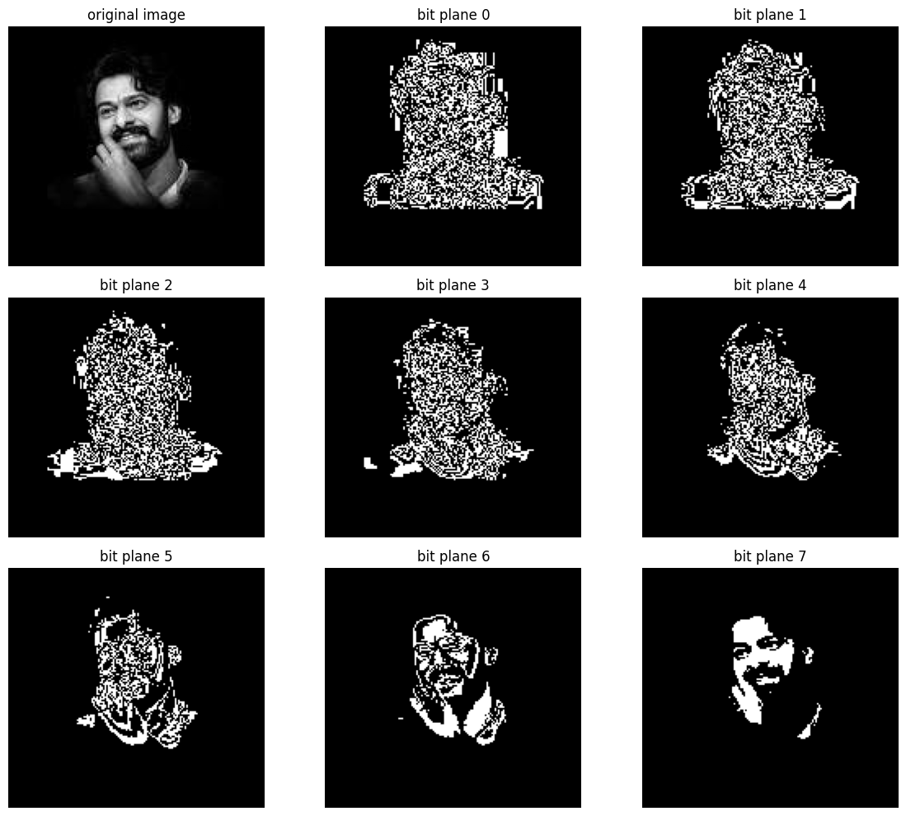

# Bit Plane Slicing Using OpenCV

## Output:

The output below shows the original grayscale image and the results obtained by extracting and visualizing all 8 bit planes.

# Author

**Shaik Khaja moin**
